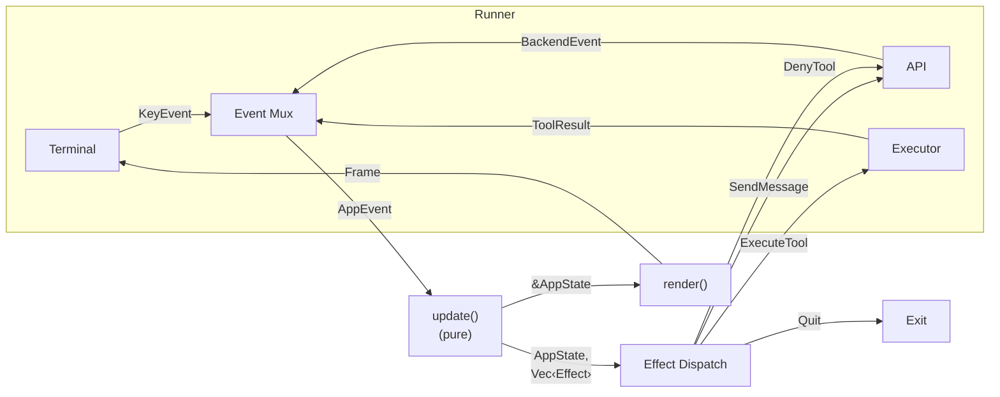
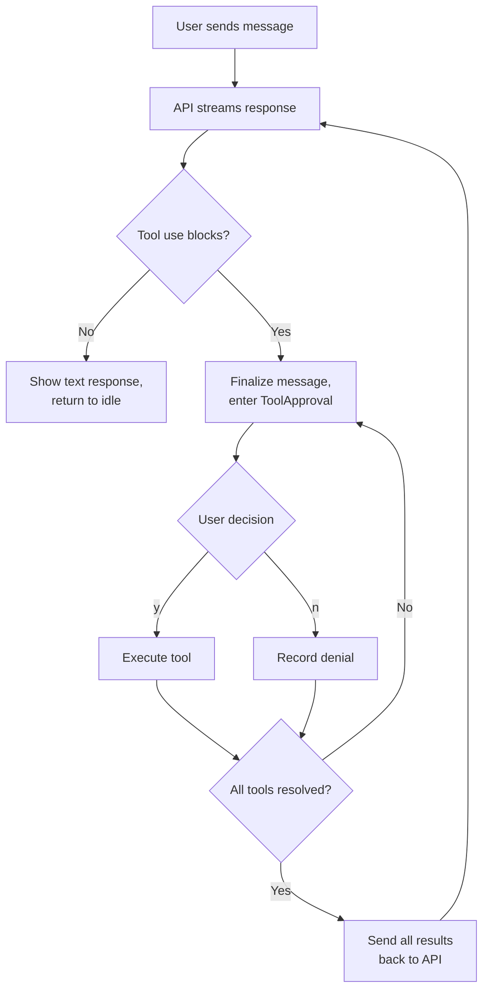
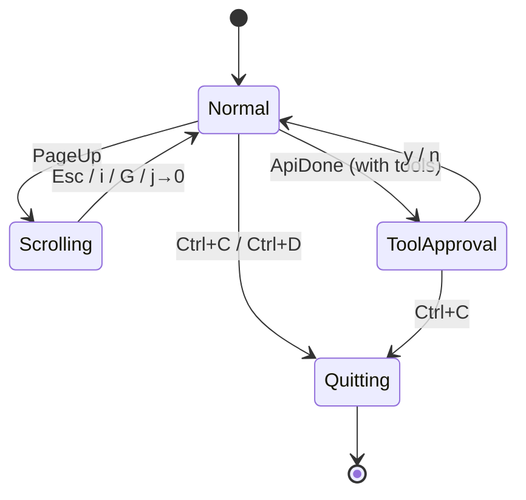
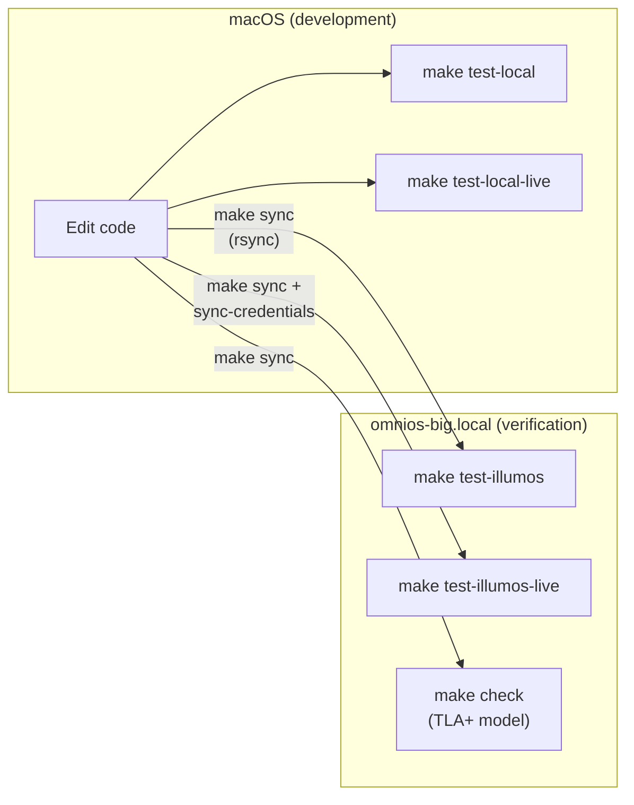
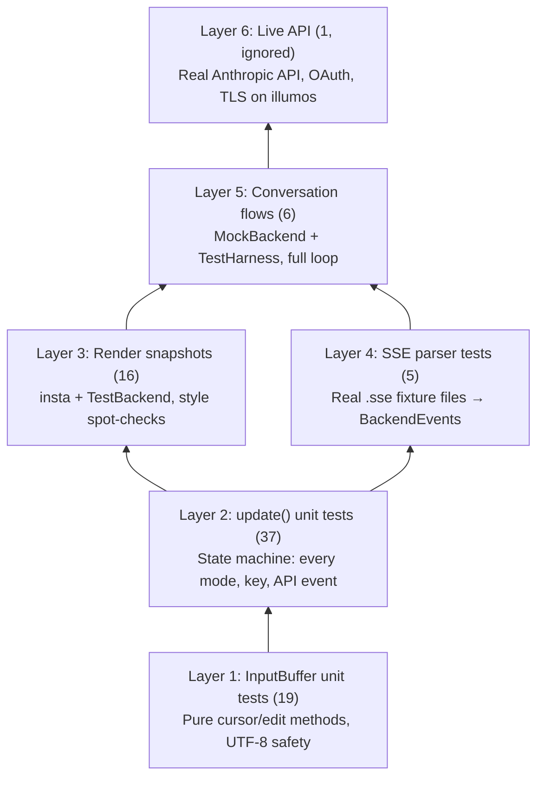
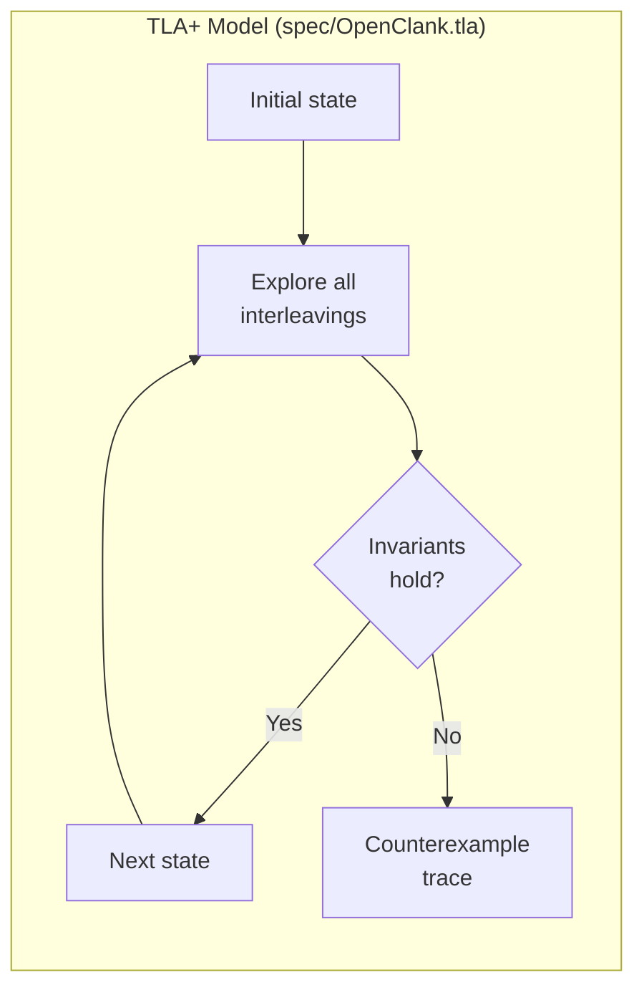

# OpenClank



A terminal interface for Claude on illumos,
where other tools have failed or proved too frail.
No Codex runs, no Gemini compiles;
this Rust TUI walks where giants have derailed.

## The Problem

The existing AI coding tools (Claude Code, OpenAI Codex,
Gemini CLI, opencode) either don't work or aren't stable
on illumos. openclank is a from-scratch Rust TUI that talks
to the Anthropic Messages API with tool use, built to run
on OmniOS and tested there from day one.

## Where to Start Reading

New to the codebase? Read in this order:

1. **[`src/state/message.rs`](src/state/message.rs)** — The data types:
   `Message`, `MessageDraft`, `Conversation`, `ToolUseId`, `ToolName`,
   `ContentBlock`. Everything else operates on these types.

2. **[`src/state/app.rs`](src/state/app.rs)** — The application state:
   `AppState` (the single source of truth), `InputBuffer` (correct-by-construction
   cursor), `Mode` (the state machine).

3. **[`src/event/update.rs`](src/event/update.rs)** — The behavior:
   the pure `update()` function that handles every event and produces every
   state transition. If a bug exists, it lives here.

4. **[`src/backend/traits.rs`](src/backend/traits.rs)** — The seam between
   the pure core and the outside world: `ChatBackend`, `BackendEvent`, `BackendError`.

5. **[`src/render/layout.rs`](src/render/layout.rs)** — How state becomes
   a screen: the top-level render entry point that splits the terminal into regions.

Each file's module-level rustdoc (`//!`) explains its role, its invariants,
and how it connects to the rest.

## Architecture

The application follows the Elm Architecture (TEA):
a pattern where the state is held apart,
and pure functions do the work of every heart —
no side effects corrupt what update sees today.



The [`update()`](src/event/update.rs) function is the single source of truth:
it takes the current state and one event in,
returns the new state and effects — no sin
of IO, no network call, no thread, forsooth.

Effects are data, not executed code —
the runner reads them, acts upon their word,
and feeds the consequences back, deferred,
as new events along the same pure road.

### The Tool-Use Loop

When Claude requests a tool, the conversation
must pause until the human grants permission.
The model sends its wish; the user decides;
the tool runs (or is denied); the loop resides:



### State Machine

The [`Mode`](src/state/app.rs) enum governs what the user sees,
which keys are active, and the UI's design.
Each arrow marks a transition, clean and fine —
no hidden paths, no tangled state to seize.



## Design Choices

### Why the Elm Architecture?

We chose this path not out of passing fashion
but from a deeply felt and reasoned passion:
the tools we use must work where we can't see,
on illumos boxes, tested headlessly.

A pure `update()` function can be called
in any test, with any state installed —
no terminal, no network, no real clock.
We feed it events and inspect the stock
of state and effects it returns, and know
exactly what the application chose to do.

The alternative — an interactive TUI
with state mutation scattered, running live —
would force us to debug by watching screens,
which fails on headless boxes and in CI.

### Correct by Construction

Where possible, we make illegal states
impossible to represent. The types themselves
prevent the bugs before they leave the shelves:

**[`Message`](src/state/message.rs) vs [`MessageDraft`](src/state/message.rs)** —
A message being streamed from the API is a `MessageDraft`.
It has `append_text()` and `add_tool_use()`.
Once streaming ends, `finalize()` consumes
the draft and yields an immutable `Message`
with no mutation methods. You cannot
append to a finished message. The compiler
enforces this — not discipline, not docs.

**[`InputBuffer`](src/state/app.rs)** — The cursor position must
always sit on a UTF-8 character boundary.
Rather than documenting this invariant
and hoping every caller obeys, the cursor
is a private field. Mutation only happens
through methods like `insert_char()`, `delete_back()`,
and `move_left()`, each of which maintains
the boundary guarantee internally.

**[`ToolUseId`](src/state/message.rs)** — The constructor validates
the `toolu_` prefix. The `Deserialize` impl
routes through the same validation. There is
no public way to create an invalid ID.

**[`Conversation`](src/state/message.rs)** — The `messages` and `draft`
fields are private. You interact through
`push()`, `start_draft()`, `finalize_draft()`,
and `discard_draft()`. The `start_draft()` method
asserts that no draft already exists.

**[`ToolName`](src/state/message.rs)** — An enum, not a string.
The compiler ensures exhaustive matching.
Adding a new tool forces you to handle
it everywhere — the match arms won't compile
until you do.

### Why Not Just Use opencode?

opencode doesn't work reliably on illumos.
But more importantly — we wanted to understand
the full stack from terminal to API, to own
the tool-use loop, the approval flow, the auth.
A tool you can't debug is a tool you can't trust.

## Development Workflow

Two machines share the labor of this trade:
a Mac where code is written, shaped, and weighed,
and an OmniOS box where truth is told —
if it compiles and tests pass there, we're gold.



### Building and Testing

```
make test-local          # cargo test on macOS
make test-illumos        # sync + cargo test on OmniOS
make test                # both of the above

make test-local-live     # hit the real Anthropic API (macOS)
make test-illumos-live   # hit the real API from OmniOS
make test-live           # both of the above
```

The `test-illumos` targets call `make sync` first,
which rsyncs the source (excluding `target/` and `.git/`)
to `root@omnios-big.local:~/openclank/`. The remote
box runs `gmake test-local` (GNU make, since illumos
`make` doesn't understand GNU Makefile syntax).

### Credential Sync

```
make sync-credentials    # scp ~/.claude/.credentials.json to OmniOS
```

The [Anthropic backend](src/backend/anthropic.rs) reads Claude Code's
OAuth token from `~/.claude/.credentials.json`. Since Claude Code
itself doesn't run on illumos, we copy the credentials from the Mac.
The token is a long-lived OAuth access token tied to the user's
Claude subscription.

### Test Layers

The tests are layered, each one built upon
the last — from pure logic to the full salon:



Layers 1-5 run on every `cargo test` with no network and no credentials.
Layer 6 runs only with `make test-live` or `-- --ignored`.

### The Mock Backend

The [`MockBackend`](src/backend/mock.rs) lives behind the `test-support`
Cargo feature, so it is never compiled
into release builds. Tests enable it via
a self-referential dev-dependency:

```toml
[dev-dependencies]
openclank = { path = ".", features = ["test-support"] }
```

This is a standard Rust pattern. Integration tests
in `tests/` compile the crate as an external dependency,
so `#[cfg(test)]` alone wouldn't expose the mock to them.

### TLA+ Model Checking

The [`spec/`](spec/) directory contains a TLA+ model
of the state machine — not the rendering,
not the cursor math, but the concurrent core:
how events interleave, how tools are approved,
how the conversation grows, and whether
invariants hold under all possible orderings.

```
make check               # run TLC model checker (downloads tla2tools.jar)
```



The model checks these invariants across
all reachable states — a million paths or more:

| Invariant                  | What it catches                          |
|----------------------------|------------------------------------------|
| `ApprovalToolsExist`       | Tool approval for a nonexistent tool call|
| `AlternatingRoles`         | Two consecutive assistant messages        |
| `NoOrphanResults`          | Tool result without a preceding tool use  |
| `DraftOnlyWhenStreaming`   | Draft leaking outside the streaming phase |
| `ToolsInDraftOnlyWhenDrafting` | Accumulated tools without a draft    |
| `PendingOnlyWhenApproving` | Pending approvals outside approval mode  |
| `ApprovedOnlyWhenActive`   | Approved tools outside active phases     |

The model found a real bug during development:
when a user approved one tool and denied another
in the same batch, the denied tool's result was
sent immediately while the approved tool was still
executing — orphaning it. The fix: all tools in
a batch must be resolved before any results are sent.

See [`spec/ANALYSIS.md`](spec/ANALYSIS.md) for the full design rationale.

## Authentication

The backend supports two authentication modes,
detected automatically by the token prefix:

| Token prefix    | Auth mode | Header                    |
|-----------------|-----------|---------------------------|
| `sk-ant-oat`   | OAuth     | `Authorization: Bearer`   |
| anything else   | API key   | `x-api-key`               |

OAuth mode (for Claude Code subscription tokens)
additionally requires:
- Beta flags in `anthropic-beta` header
- A billing signature in the system prompt
  (see [`build_billing_header`](src/backend/anthropic.rs))
- The Claude Code identity string
- A `user-agent` mimicking `claude-cli`

This matches the protocol used by the
[opencode-claude-auth](https://github.com/griffinmartin/opencode-claude-auth)
plugin and allows openclank to share the user's Claude Code
subscription without a separate API key or billing account.

## Status

The pure core is complete and tested (99 tests).
The rendering layer produces correct output.
The API backend connects and authenticates.
What remains is the runner — the event loop
that ties terminal, backend, and executor
together into a living, breathing TUI.

---

*This project exists because the tools we trust*
*should run on every system that we must.*
*If illumos is where your work is done,*
*then openclank shall be your Claude, bar none.*
