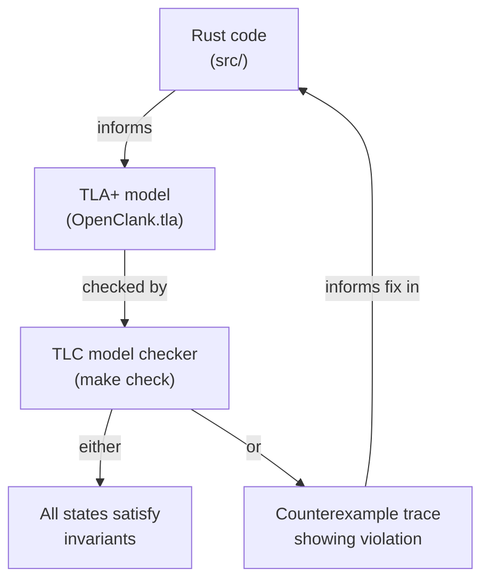

# spec/

A formal model of the state machine's soul —
not rendering, not cursor math, not scroll,
but how events interleave, how tools resolve,
and whether invariants hold as states evolve.

This directory contains a TLA+ specification that models the
concurrent aspects of openclank's state machine. The
[`update()`](../src/event/update.rs) function is pure and
single-threaded, but the *runner* that feeds it events is
concurrent: terminal input, API streaming, and tool execution
all produce events independently. The model explores all possible
orderings to verify that invariants hold regardless of timing.

## How It Fits



## What the Model Captures

The model has five phases (idle, streaming, approval, executing,
quitting) and tracks how the conversation grows as users send
messages, the API responds with text or tool calls, tools are
approved or denied, and results flow back. It captures the
multi-tool approval batch: all tools in a response must be
resolved before any results are sent.

It also models `ApiError` (draft discarded, return to idle) and
`UserQuit` (available from any non-quitting phase).

## What It Doesn't Capture

Tool input content, scroll math, cursor positioning, and rendering.
These are numerical or visual concerns, not state machine concerns.
The model operates at the level of *structure* — which messages
exist, what roles they have, whether tool results have matching
tool calls — not *content*.

## Running

```
make check    # downloads tla2tools.jar if needed, runs TLC
```

See [ANALYSIS.md](ANALYSIS.md) for the detailed design rationale,
the list of invariants checked, and what the model has found.
