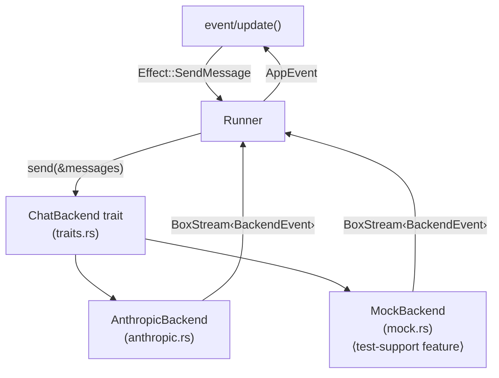

# backend/

The bridge between our app and Claude's own mind —
a trait that hides the wire, the auth, the stream,
so tests can mock what production calls must find,
and both can share a single downstream seam.

This module defines the [`ChatBackend`](traits.rs) trait that
abstracts over how messages are sent to the model and responses
received. The trait returns a stream of events, which the runner
maps to [`AppEvent`s](../event/input.rs) and feeds into
[`update()`](../event/update.rs).

## How It Fits

## Concepts

**Two implementations** serve different purposes. The real
[`AnthropicBackend`](anthropic.rs) hits the Anthropic Messages API
with OAuth or API key auth and parses SSE responses. The
[`MockBackend`](mock.rs) returns canned responses for testing — it
is gated behind the `test-support` Cargo feature so it never ships
in release builds.

**SSE parsing** handles the Anthropic streaming protocol where tool
call arguments arrive incrementally via `input_json_delta` events
(per the [streaming docs](https://platform.claude.com/docs/en/api/streaming#input-json-delta)).
Partial JSON strings are accumulated and parsed on `content_block_stop`.
The [`test_fixtures/`](test_fixtures/) directory contains real SSE
response samples for each scenario.

**Authentication** is detected by token prefix: `sk-ant-oat` tokens
use OAuth (Bearer auth with billing headers and the Claude Code
identity string), everything else uses the simpler `x-api-key` header.
This lets openclank share a Claude Code subscription without a
separate API billing account.
