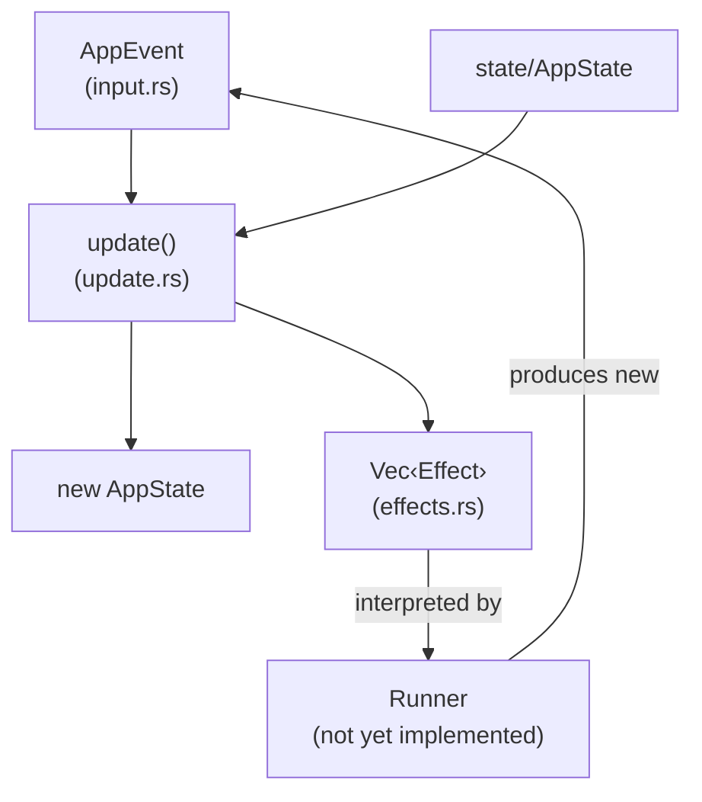

# event/

The beating heart where all behavior dwells —
a single function, pure and crystalline,
that takes the world as input, draws a line,
and hands back what has changed, and what compels.

This module implements the Elm Architecture's core loop:
a pure [`update()`](update.rs) function that takes the current
[`AppState`](../state/app.rs) and an event, and returns the new
state plus a list of side effects to execute.

## How It Fits

## Concepts

**Events** ([`AppEvent`](input.rs)) are the union of everything that
can happen: keyboard input, terminal resizes, API streaming chunks,
tool-use requests, tool results, and periodic ticks. They come from
the runner, which multiplexes terminal input, API responses, and
tool executor output into a single stream.

**Effects** ([`Effect`](effects.rs)) are the things the update function
*wants* to happen but cannot do itself (because it's pure). Send a
message to the API, execute an approved tool, deny a tool, quit the
app. Effects are data — the runner interprets them.

**The update function** ([`update()`](update.rs)) is the only place
application behavior lives. It is organized by [`Mode`](../state/app.rs):
different keybindings are active depending on whether the user is
typing, scrolling history, or reviewing a tool approval. It never
touches IO, which is why the entire behavioral core is testable with
37 unit tests that run in milliseconds.
