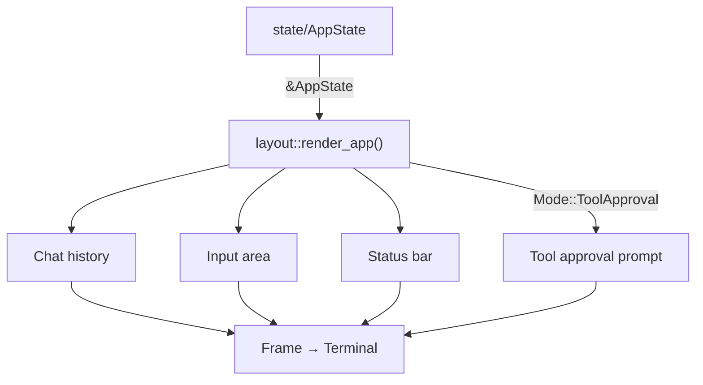

# render/

From state to screen, these functions draw the frame —
each one a pure transform, no IO to blame.
A `TestBackend` in tests, a terminal in life;
the render code itself knows neither strife.

This module contains ratatui rendering functions that transform
[`AppState`](../state/app.rs) into terminal output. Every function
takes a `Frame` and a reference to state — nothing is mutated, no
events are produced, no side effects occur.

## How It Fits

## Concepts

The screen is split into three vertical regions: a scrollable
**chat history** filling most of the space, a **text input** (or
**tool approval prompt** when the model is requesting a tool) in
a fixed 3-row area, and a single-row **status bar** showing the
model name and current status.

Messages render with color-coded role prefixes (blue for user,
green for assistant). Tool-use blocks appear in yellow with a
summary of their arguments; tool results show truncated output.
The in-progress [`MessageDraft`](../state/message.rs) renders live
as text streams in.

Tool input summaries (the one-line description of what a tool call
will do) are produced by a shared `format_tool_input()` function
so that the chat history and the approval prompt show identical
formatting — including "(write)" and "(edit)" suffixes for
destructive operations.

## Testing

Render tests use **insta snapshots** for text layout verification
and **direct Buffer cell assertions** for color/style checks.
Snapshots live in `snapshots/` and are managed with
`cargo insta review`. A shared `test_support::render_to_string()`
helper avoids duplication across test modules.
