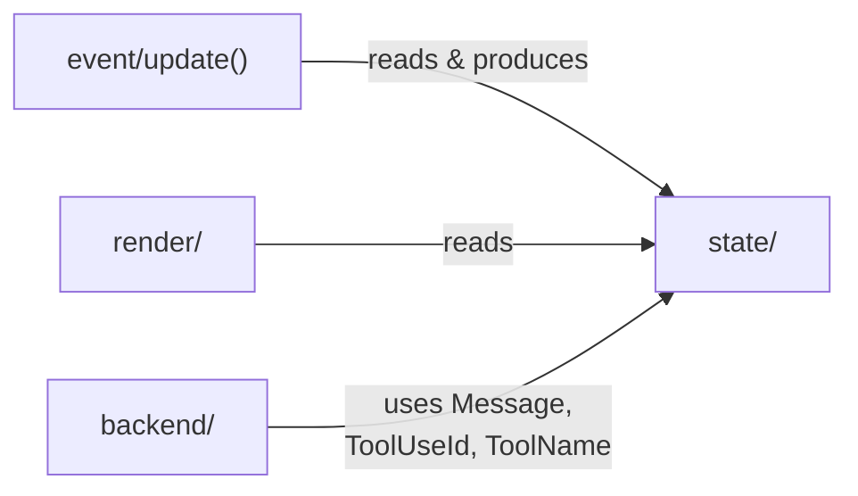

# state/

The data types that define reality —
immutable, pure, and free from side effect.
No IO lives here; no network to inspect;
just structs and enums, shaped with clarity.

This module contains every type that [`update()`](../event/update.rs)
reads and produces, and every type the [render](../render/) layer
draws from. It is the single source of truth for the entire
application.

## How It Fits

## Concepts

The root type is [`AppState`](app.rs): conversation, input buffer,
mode, scroll position, status bar, viewport, model name. Everything
the renderer needs to draw a frame and the update function needs to
process an event lives here.

**Typestates** enforce lifecycle correctness. A streaming response
is a mutable [`MessageDraft`](message.rs); once finalized it becomes
an immutable [`Message`](message.rs). The compiler prevents appending
to a finished message.

**Correct-by-construction types** make invalid states unrepresentable.
[`InputBuffer`](app.rs) keeps its cursor on UTF-8 boundaries by hiding
the cursor behind methods. [`ToolUseId`](message.rs) validates its
`toolu_` prefix on construction and deserialization.
[`Conversation`](message.rs) exposes private fields only through
invariant-maintaining methods. [`ToolName`](message.rs) is an enum so
the compiler enforces exhaustive handling.
