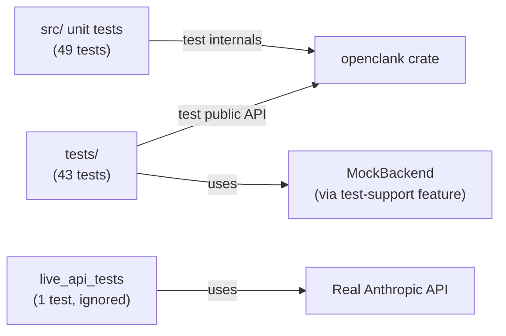

# tests/

Integration tests that exercise the crate
from outside — as a dependency, not from within.
They test behavior, not the internal state,
and prove the public API is worth its skin.

These are Rust integration tests (compiled as separate binaries
against the crate's public API). They complement the unit tests
inside `src/` by testing cross-module behavior and the full
conversation loop.

## How It Fits

## What Lives Here

**Update tests** verify the pure [`update()`](../src/event/update.rs)
function exhaustively: every keybinding, every mode transition,
every API event, every tool-use flow. These are the behavioral
specification of the app.

**Conversation flow tests** drive full multi-turn conversations
through a `TestHarness` that wires [`update()`](../src/event/update.rs)
to the [`MockBackend`](../src/backend/mock.rs). They prove that
sending a message, receiving a tool-use response, approving the
tool, and getting a final answer all work end-to-end.

**Live API tests** hit the real Anthropic API with OAuth credentials.
They are `#[ignore]`d by default and run only with `make test-live`.
They verify TLS, authentication, billing headers, and SSE parsing
against production — the ultimate "does it actually work" check.
